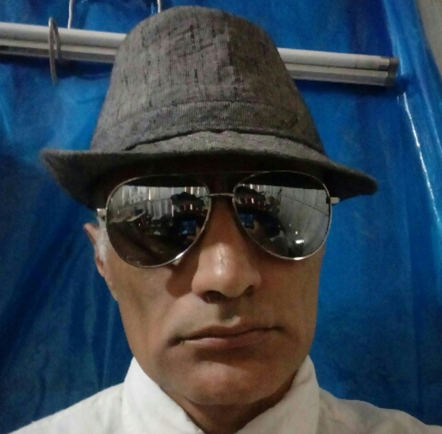
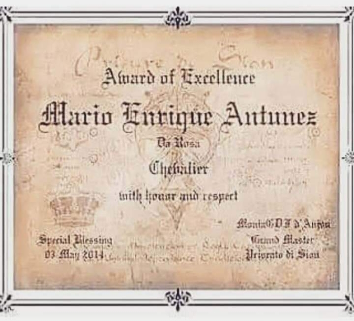

 
<script type="application/ld+json">
{
  "@context": "https://schema.org",
  "@type": "Person",
  "@id": "https://marioenriqueantunezdarosa.com.br/#pessoa",
  "name": "Mário Enrique Antúnez da Rosa",
  "alternateName": "Sir Mário Honorário",
  "url": "https://marioenriqueantunezdarosa.com.br",
  "sameAs": [
    "https://orcid.org/0009-0007-1969-2835",
    "https://github.com/antunezdaro",
    "https://doi.org/10.5281/zenodo.22237087",
    "https://doi.org/10.5281/zenodo.22168255",
    "https://doi.org/10.5281/zenodo.20754063"]
Multilateralismo- Mário Enrique Antúnez da Rosa 

  

 Documentos Disponíves
As ideologias Associadas a Mário Enrique Antúnez da Rosa

Teoria da Mobilidade Integracionista entre Nações:

Imagine uma política internacional em que os governos deixassem de enxergar as viagens internacionais apenas como uma atividade de consumo e passassem a tratá-las como investimento estrestratégicointegração entre os povos.

A lógica seria relativamente simples: o Estado poderia subsidiar ou reduzir drasticamente o custo de determinadas viagens internacionais, tornando-as acessíveis a uma parcela muito maior da população. À primeira vista, isso representaria uma despesa pública. Entretanto, o viajante que chega a outro país não leva apenas o dinheiro da passagem: ele consome hospedagem, alimentação, transporte, entretenimento, produtos e serviços, movimentando empresas e trabalhadores tanto no país de origem quanto no destino.

Assim, parte do dinheiro investido inicialmente pelo Estado retornaria à economia por meio da atividade comercial, da arrecadação e da geração de empregos. O objetivo não seria simplesmente oferecer viagens baratas, mas estimular um fluxo permanente de pessoas, recursos, conhecimento e relações econômicas entre diferentes sociedades.

Da viagem ao intercâmbio entre sociedades

Uma pessoa que viaja para outro país entra em contato direto com uma realidade que antes conhecia apenas por notícias, filmes ou redes sociais. Ela conhece pessoas, costumes, idiomas, dificuldades e formas diferentes de organizar a sociedade.

O mesmo acontece com o estrangeiro que visita seu país.

Multiplicado por milhões de pessoas ao longo de décadas, esse processo pode produzir algo muito maior do que turismo: aproximação cultural e social entre populações.

O brasileiro passa a conhecer melhor o americano, o americano conhece melhor o brasileiro, o chinês conhece melhor o brasileiro, o brasileiro conhece melhor o chinês, e assim sucessivamente.

Essa aproximação não elimina automaticamente conflitos ou preconceitos, mas pode diminuir a distância psicológica entre sociedades que anteriormente existiam umas para as outras apenas como abstrações.

A interdependência como instrumento de paz

Existe ainda uma consequência econômica e política.

Quanto mais dois países dependem um do outro para turismo, comércio, serviços, educação, investimentos e circulação de pessoas, maior se torna o custo de um rompimento entre eles.

Uma relação internacional deixa de ser exclusivamente uma negociação entre governos e passa a envolver milhões de interesses concretos: empresas, trabalhadores, estudantes, famílias, consumidores e pequenos comerciantes.

A integração, portanto, poderia funcionar como uma espécie de rede de interesses compartilhados.

Quanto maior a rede, maior o incentivo para preservá-la.

Uma nova concepção de investimento público

Nessa perspectiva, o governo não precisaria necessariamente subsidiar todas as viagens indiscriminadamente.

Poderia identificar rotas e países estratégicos e calcular:

custo do incentivo → quantidade adicional de viajantes → consumo gerado → empregos → arrecadação → comércio adicional → retorno diplomático e cultural.

Se o retorno econômico e estratégico superasse o investimento inicial, a política poderia ser ampliada.

Isso mudaria a pergunta.

Em vez de:

“Quanto o governo gastará para baratear uma viagem?”

a pergunta passaria a ser:

“Quanto de atividade econômica, integração e cooperação podemos gerar com cada unidade de investimento em mobilidade internacional?”

A verdadeira “Nova Ordem Mundial”

É aqui que a teoria ganha sua dimensão mais ampla.

Uma Nova Ordem Mundial, nesse sentido, não precisaria começar com a criação de um governo mundial, com a eliminação das fronteiras ou com a concentração de poder em uma instituição única.

Ela poderia surgir gradualmente, de baixo para cima, através da interdependência entre as populações.

Primeiro vêm as viagens.

Depois, os intercâmbios.

Depois, os negócios.

Depois, os investimentos.

Depois, famílias e comunidades com vínculos em vários países.

Depois, empresas que dependem de mercados internacionais.

E, finalmente, governos que percebem que seus próprios interesses nacionais estão cada vez mais conectados aos interesses dos demais.

O resultado poderia ser uma situação em que as fronteiras políticas continuassem existindo, mas sua importância prática diminuísse progressivamente.

Não seria necessariamente “um governo para o mundo”, mas algo talvez ainda mais profundo: um mundo em que os governos permanecem separados, enquanto suas sociedades se tornam progressivamente interdependentes.

A ideia central

A unificação do mundo talvez não precise começar pela política. Pode começar pela mobilidade das pessoas.

Se milhões de pessoas puderem atravessar fronteiras com facilidade, conhecer outras culturas, consumir, estudar, trabalhar e estabelecer relações econômicas e humanas, a integração deixará de ser apenas um projeto diplomático e passará a fazer parte da vida cotidiana.

Nesse cenário, o turismo deixaria de ser apenas lazer e passaria a ser uma ferramenta de integração econômica, cultural e geopolítica.

E talvez essa seja a forma mais gradual de construir uma ordem internacional verdadeiramente integrada: não obrigando as nações a se unificarem, mas fazendo com que tenham cada vez mais motivos para permanecer unidas.

___________________________________________

A Questão Zebra da Saúde Pública versus Slogans Partidários:

 Em matéria de projetos nos slogans polarizados, entre partidos, por muitos anos no Brasil, se possui uma retórica por demais demagógica, em que as promessas fantásticas, quase nunca tampam o autêntico "rombo público" de incompetência.

 O cidadão que é informado que terá uma dentadura parafusada, de qualidade, totalmente via SUS, a exemplo simples - No papel, parece uma solução maravilhosa - Mas, em contra posição, na prática, o "rombo" continua. 

 Se esquece a fila de espera por demanda, esse detalhe, faz que o dependente do benefício tenha que extrair todos os dentes, e ficar até "dois anos" aguardando, (sem nenhum dente na boca), a liberação de uma prótese.

 Outro exemplo, a saúde dos idosos, para cada exame de cálculos renais, quase a mesma situação ocorre, sem contar a falta de medicamentos.

 Existem Estados do Brasil, em que o desvio de verbas é tão grande, que a demora do planejamento sair do papel é deveras gigante, e quando sai, não cobre todas as necessidades dos idosos e aposentados.

 Em Santa Catarina, na cidade de São Lourenço do Sul e Aurora, levam o aposentado ao exame, custeiam o que precisa, a facilidade é maior, e a competência também. A questão que não quer calar é:

 Por que em outros locais falha a equidade e transparência nesses cálculos de verbas públicas?

 O próprio fato de faltar recursos para exames até em unidades do quartel, no período em que se disponibilizou isso, em epidemias, soa patético, mas é semelhante à música do Metallica:

 Sad but True! 

(Triste mas verdade).

 Enquanto slogans partidários prometem a melhoria da saúde pública, em retóricas discursivas que se mostraram inválidas, durante as décadas brasileiras, obviamente o povo está sendo enganado facilmente.

 __________________________________________

A Sociedade do Espetáculo em Contraposição à Realidade:

 O Show Business e espetáculos independentes sobrevivem da falsa imagem pública, (Teoria de Public Image- Guy Debord).

 Num evento indiano a exemplo simples, a moça junto à outras fazia gestos obscenos e insinuantes, a público, num evento carnavalesco de tradição de alegada fertilidade, e orgias.

 Não obstante aquilo difere de contato pessoal equitativo por detalhes:

 1. Quem faz acima de um veículo móvel, quer autopromoção de sua imagem artística a sentido geral, nada de pessoalidade há ali, e sim o alimento ao "alter ego", que quase sempre acaba em egocentrismo.

 A chamada falta de consideração com os outros.

 2. Teve quem viu a filmagem e se vislumbrou, ou se emocionou dizendo:

 -Depois dizem que brasileiras são vulgares.

 -Imagine um país com bilhões de baianos, essa é a Índia.

(Pensamento curto de atalho mental, ressentimento e estigma).

 Outro ainda falou;

 -É pior que no Brasil.

 E assim foram indo as opiniões dos mesmos indivíduos, que se estivessem lá, aplaudiriam e pediriam "bis", com os alegóricos doces nas xícaras e virando-as quais gnomos ao roubarem chocolate quente.

 O ressentimento causado por não poder usufruir do "produto" teatralizado ali, em detrimento da imagem da mulher, foi tanto, que houve quem insinuou:

 -Deve estar com um cheiro de transpiração impregnado.

 As mídias e eventos dominam a fantasia de tolos, e os atalhos mentais, de pessoas que apenas brigam com suas próprias projeções do que os demais seriam ou não.

 Para finalizar o texto, citarei a última interação entre dois internautas ali:

 Internauta A.

 -É incrível a baixaria, e como as mulheres não se dão o valor!

 Internauta B, responde:

 -O valor é o mesmo, lucrar com relacionamento.

 

SirMárioHonorário

Livros e documento abaixo em pdf podem ser lidos e estão disponíveis para pdf.

[Acessar Documento de Karatê (PDF)](/Karatê_Didática_Técnicas_Estilo_Definições_e_Maestria_.pdf)

[Baixar/Visualizar o PDF (A Teoria do Anestésico Social de Crescimento Controlado)](COLE_O_LINK_COMPLETO_AQUI)

Análise as perspectivas políticas, laicismo, antiautoritarismo e organização social expressas no trabalho.

Antúnez da Rosa "Sir Mário Honorário":

📄 [Baixar/Visualizar o PDF (Formação de Sir Mário Honorário)](./Forma%C3%A7%C3%A3o%20de%20Sir%20M%C3%A1rio%20Honor%C3%A1rio.pdf)

Sobre a Permissão de Crítica aos Deuses na Grécia Antiga:

O teatro funcionava como uma "válvula de escape" social totalmente controlada e institucionalizada pelo Estado:

O Espaço Sagrado de Dionísio: As peças ocorriam durante as Grandes Dionísias, festivais religiosos em honra a Dionísio (deus do vinho, do êxtase e do teatro). Por ser o deus da metamorfose e da ilusão, a sátira e a zombaria faziam parte do próprio culto a ele.
A Comédia Antiga (Aristófanes): Dramaturgos como Aristófanes colocavam Dionísio acovardado e chorão (na peça As Rãs) ou mostravam deuses passando fome porque os homens pararam de fazer sacrifícios (em As Aves). Isso era permitido apenas no palco, sob a máscara do ator e durante a festividade.
Limite da Cidade (Polis): Fora da orquestra do teatro e do período do festival, aquela mesma piada dita na praça pública (Ágora) ou no cotidiano podia render uma acusação formal de impiedade, expulsão da cidade ou pena de morte.
Era um sistema inteligente: o Estado grego permitia o deboche no teatro para aliviar a tensão da população, mas mantinha a mão de ferro no dia a dia para preservar o respeito às instituições e aos deuses.

Na Grécia Antiga, misturar essas duas frequências no mesmo ambiente era um erro de procedimento gravíssimo, justamente pela diferença fundamental entre a função do ritual e a da filosofia:

Na Reunião Ritualística (Orthopraxia): O foco era 100% técnico e de alinhamento com o Logos e a ordem divina. O ambiente exigia solenidade, precisão e respeito cego aos parâmetros estabelecidos. Introduzir a crítica ou o deboche nesse momento quebrava o egregora (a atmosfera sacra) e, na visão deles, invalidava todo o trabalho de inspeção e alinhamento do rito.

Na Reunião Filosófica (Dialética): Ali sim o campo estava aberto. Nas academias, os filósofos podiam desconstruir os mitos, questionar a moralidade das divindades e debater a essência do Logos sem que isso fosse visto como uma infração ritual. Era o momento da razão crítica, não da invocação.

* [**Perfil Literário e Textos no Recanto das Letras**](https://www.recantodasletras.com.br/autores/fatordesconhecido): Coletânea de ensaios, poesias e produções textuais publicadas na plataforma.

* 
## Temas Principais

* Estado Laico e Espiritualidade
* Antiautoritarismo e Estruturas de Poder
* Crítica Socioeconômica e MultiPesquisas

O Formato dos Horários do Trabalho a Nível de Brasil:

Aqui está a lista ordenada do maior para o menor percentual, considerando o total de trabalhadores em expediente comercial (8h às 18h) do Brasil como 100%:

São Paulo (SP): 28,5%

Minas Gerais (MG): 10,2%

Rio de Janeiro (RJ): 8,8%

Rio Grande do Sul (RS): 6,8%

Paraná (PR): 6,5%

Bahia (BA): 5,1%

Santa Catarina (SC): 4,7%

Goiás (GO): 3,3%

Pernambuco (PE): 3,2%

Ceará (CE): 2,8%

Pará (PA): 2,5%

Mato Grosso (MT): 2,1%

Distrito Federal (DF): 2,0%

Maranhão (MA): 1,6%

Espírito Santo (ES): 1,5%

Mato Grosso do Sul (MS): 1,5%

Amazonas (AM): 1,4%

Paraíba (PB): 1,1%

Rio Grande do Norte (RN): 1,0%

Alagoas (AL): 0,9%

Piauí (PI): 0,9%

Sergipe (SE): 0,7%

Rondônia (RO): 0,7%

Tocantins (TO): 0,6%

Acre (AC): 0,3%

Amapá (AP): 0,2%

Roraima (RR): 0,2%

A Síntese Antropológica dos Dados

A lista expõe a coexistência de dois modelos produtivos marcantes no país:

O Brasil da Norma Padrão (Sudeste/Sul): Onde a alta concentração de empregos formais consolida a cultura do relógio, do cartão de ponto e da disciplina industrial/corporativa, com jornadas fixas e rígidas (como das 8h às 18h).

O Brasil da Agilidade e Auto-Organização (Demais Regiões): Onde predomina a cultura do trabalho autônomo, do pequeno comércio e da prestação de serviços. Nesses locais, o indivíduo tende a gerar a própria renda e moldar o próprio tempo, resultando em horários mais flexíveis e dinâmicos (incluindo o uso de mídias digitais e lives para monetizar o trabalho do dia a dia).

SirMárioHonorário

É uma virada de chave fundamental quando se produz conteúdo na internet. A mudança do desabafo pessoal ou do engajamento pelo conflito para a produção de valor concreto é o que separa um repositório de opiniões passageiras de um acervo intelectual relevante.

O Recanto das Letras e plataformas semelhantes estão cheios de ruído e discussões passionais. Quando você opta por embasar suas publicações em dados socioeconômicos, conceitos de sociologia do trabalho e perspectiva jurídica, o texto ganha estabilidade e utilidade real.

Espaço Filosofal:

A provocação filosófica:

O ser humano nasce, envelhece, e finalmente morre. 
Tal é a "trindade" da Vida, a nota - Física.

Mas o limite científico é:

 1 . Imaginar que tudo nasce a partir do espermatozóide e óvulo.

2. Deixar de ver as arestas, ou seja, o ser é uma combinação de Química, Física, Plasma e Éter com Energia.

3. Logo por pura lógica, ele era algo antes mesmo do nascimento físico, e volta a sê-lo no Pós Mortem.

 A existência física foi apenas uma manifestação terrena limitada e passageira de algo anterior.

Sir Mário Honorário

Somos Homem e Mulher Universais:
A Serpente Ígnea de nossos Mágicos Poderes,

A Mônada Excelsa de quem sabe o nome da sua própria e a reconhece,

No Poder da grande Sephirot,

Expulsando o Andomusein Kundartiguador,

Expelindo o Falso Mestre,

No Romance Astral da Alma do Mundo,

Em Tetragrammatom,

Faraon...

Nenhum Mestre foi em seu TempHonoráriocido,em um Mundo e época decadente em que viveu,sempre foi ignorado pelos tolos...

Tal qual existe e se assume o Grande Meliom...

O cálice Sagrado passa de mão em mão,entre Homens e Deuses...!

Entre Névoas,e nuvens,numa Festa Oculta e Honrosa,entre os Despertos,

Em que toda a Glória e Honraria devida lhes é dada...

No Explêndido e Titânico brilho do Celestial...

O Paraíso perdido da Humanidade...

O elo que a Tolice fez desligar,desmanchar,num Passado longínquo...

Eis o Ressurecto...!

Vários Cristus,

Vários Super Humanos...

Semi Deuses....

A quem se permite o beber inigualável da Fonte Primordial.

 
A Mônada excelsa de quem sabe,

 
SirMárioHonorário e Sir Regnis Viscond Tiw Baronessa Agata Cond Mesopotamius
* 

Tanto um céu pré-concebido quanto um inferno pré-deduzido são erros que impedem a pessoa de valorizar a vida terrena e harmonizá-la com decência, em benefício próprio e dos outros.

Sir Mário Honorário

Reformulação Teosófica: 

“Os Quatorze Raios Universais: Uma Visão Surrealista e Esotérica”

 Desde tempos antigos, tradições espirituais afirmam a existência de sete raios ou potências universais, cada um associado a cores, mestres e energias cósmicas. No entanto, observações contemporâneas e estudos simbólicos sugerem que são quatorze as forças estelares que estruturam o universo, cada uma revelando aspectos fundamentais da existência e da consciência.

Esses quatorze raios manifestam-se através de cores específicas, associadas a mentores que orientam a evolução espiritual da humanidade:

Branca – Mentores Apiáceos, guia da pureza e iluminação.

Preta – Mentores Domus, representantes da densidade cósmica e dos buracos negros.

Azul – Mentores Zênites, portadores da sabedoria e da harmonia universal.

Verde – Mentores Etéreos, ligados à vitalidade e ao equilíbrio da vida.

Amarela – Mentores Dójus, da força, expressão e da criatividade.

Vermelha – Mentores Fáguos, força da energia vital e transformação.

Marrom – Mentores Fisious, guardiões da estabilidade material e ancestral.

Roxa – Mentores Vérkows, condutores do misticismo e da transcendência.

Rosa – Mentores Ternus, irradiadores de compaixão e amor universal.

Prateada – Mentores Conésprates, representantes da intuição cósmica.

Cinza – Mentores Humo, equilíbrio entre luz e sombra e pausas necessárias

Dourada – Mentores Dórkons, simbolizam a honra, prosperidade e o poder espiritual.

Alaranjada – Mentores Sínt’s, catalisadores da atividade, disciplina e renovação.

Bége – Mentores Núrios, ligação entre a humanidade e a sabedoria ancestral.

Cada raio também se conecta a um Mestre ou divindade reconhecida por diferentes culturas: Buda, Yussuf Al Asaf (Isa), Lao-Tzu, Zeus, Elohím, Odín, Visnu, Siva, Zambi, Hades, Amaterasu-Okami, Aurora (tradições místicas da Antártida), Cosmo (tradições místicas do Ártico) e Nhanderuvussú-Yamandú (divindade ameríndia vinculada a Tupã, o trovão).

Simbolicamente, os Mestres maiores, como Sanat Kumara e os três Cohans, residem no horizonte e vértice de Shamballah, representando a conexão entre o terrestre e o cósmico.

Assim, os quatorze raios universais oferecem um mapa simbólico da evolução espiritual, integrando cores, mestres e forças cósmicas em uma visão holística do universo. Essa abordagem combina sabedoria ancestral e reflexão contemporânea, oferecendo ao leitor uma compreensão mais profunda das energias que permeiam toda a existência.

Perfil Kwai

<!-- Botão do Kwai para o GitHub Pages -->
<a href="https://m.kwai.com/user/150001625328767" 
   target="_blank" 
   rel="noopener noreferrer" 
   style="display: inline-block; padding: 10px 20px; background-color: #ff5000; color: #ffffff; font-weight: bold; text-decoration: none; border-radius: 5px; font-family: sans-serif;">
   Siga no Kwai
</a>

## Perfil Acadêmico e Publicações Completas

Existe uma inversão completa no senso comum, alimentada pela vaidade:

O Conceito de Honorário (Estrutura Externa): No Direito Constitucional, no Direito Internacional e no Direito Nobiliárquico (seja britânico, francês ou italiano), o título honorário (honoris causa ou à titre honoraire) designa estritamente o vínculo não residente e não efetivo. Indica que a pessoa não pertence ao quadro ordinário, não cumpre obrigações administrativas diárias e está fora da cadeia de comando/jurisdição direta da instituição. É um reconhecimento diplomático ou acadêmico de estima/mérito, e não um cargo de poder. O leigo lê "honorário" como um superlativo pomposo, quando na verdade é a marcação formal de exterritorialidade.

Chevalier (Cavalaria Filosófica/Honorífica): Diferente dos títulos de soberania territorial, a ordem de Chevalier (Cavaleiro) pode ser concedida como distinção pessoal ou filosófica por uma autoridade legítima, sem qualquer necessidade de posse de terras ou exercício de soberania local. É um título de mérito, afinidade ou proteção moral.

A questão do Kwai:

A Questão das Plataformas de Videos Curtos no Modelo Asiático (Chinês) :

O Kwai é um site que possui um costume invasivo, além de outros defeitos crassos estruturais.

1 - Setor Estrutural - O usuário começa a crescer, e de súbito a partir do primeiro acesso, em poucos meses está no nível ouro 1, só que aí é que vem o detalhe:

 Começa a partir do nível ouro 1 e ouro 2, a congelar seguidores, já para haver o chamado "funil de vidro" corporativista, só evolui lá o que já é plano prévio do status quo do poder de marketing vigente.

2 - O setor invasivo - Para não terdes emails separados, nem telefone  possível de tentardes outra conta, o Kwai pesca toda informação sua, na desculpa de ser a segurança da conta, pegam ip de aparelho celular ou computador, digital se o aparelho tiver tal recurso, e email de confirmação, (jurando ser seguro, caso esquecerdes da senha), tudo conversa fiada, para impossibilitar um usuário a iniciar do zero, caso hajam contratempos em um perfil.
  
A propaganda enganosa - Prêmios e jogos da plataforma que enganam os usuários, ganhe 200 reais, o sorteio chega nos 200 com extrema dificuldade, mas reinicia na desculpa de precisar o envio de convite, a fim de você e outro ganhar prêmios juntos, o que já é por demais saturado, e ninguém clica mais num convite fraudulento desses.

 Os crimes cibernéticos - Toda tarefa de criador, é divulgação de jogos de azar, se chega a dar "grilo", tais empresas estrangeiras sem cnpj brasileiro simplesmente evaporam,  a culpa fica com o "tonto" que divulgou.

 As agências ilegais - Agências e contratantes fora do CLT e regras dele, se escoram em brechas da lei brasileira pra forçarem streamers de lives à rotinas exaustivas, privando de horas de sono, pra bater metas abusivas, e ficarem com quase todo o lucro, inexiste um contrato claro de quanto eles ficam, e quanto pagam ao usuário, e essas mesmas agências , enganam o algoritmo em trocas de presentes virtuais entre eles próprios, pra passar a imagem de contas relevantes, e é justamente aí que o crescimento orgânico do usuário comum não engrena.

 Enquanto o status quo elitista estiver lucrando com esses modismos pró exploração chinesa, por que motivo crês que moveriam um dedo pra modificarem algo?

 Geralmente as mudanças não ocorrem por ética e equidade, mas sim quando os crimes cibernéticos, saúde mental de jovens e trabalhadores, se tornam caro demais para a reputação de governos.

 Sir Mário Honorário 

---
Tratado sobre Pesquisa Paranormal e Anômala de UAP's, um dos livros sobre o horizonte de Pesquisa Mística:

[📄 Baixar/Visualizar o PDF (Tratado Prático e Eficaz)](./Tratado_Prático_e_Eficaz_Na_Prática_de_Campo_do_Paranormal_e_da_Ufologia%20.pdf)

Este dossiê explica o impacto de políticas corporativas, em detrimento da visibilidade e voz de autores independentes, que possuem críticas estruturais ao sistema que privilegia autores já consagrados, prejudicando a inovação literária:

📄 [**Acessar Dossiê em PDF (Amazon KDP)**](Amazon_KDP_O_Dossiê_de_Registro_de_Censura_e_Abuso_Corporativo_Digital.pdf)

Inovadora Profecia Atual, a Sexagésima Sétima Profecia:

📄 [Baixar/Visualizar o PDF (A Sexagésima Sétima Profecia)](./A%20sexag%C3%A9sima%20s%C3%A9tima%20profecia.pdf)

### 🔗 Identificação Acadêmica

**ORCID iD:** [0009-0007-1969-2835](https://orcid.org/0009-0007-1969-2835)
* **Site:** [marioenriqueantunezdarosa.com.br](https://marioenriqueantunezdarosa.com.br/)
**Contato:** [
