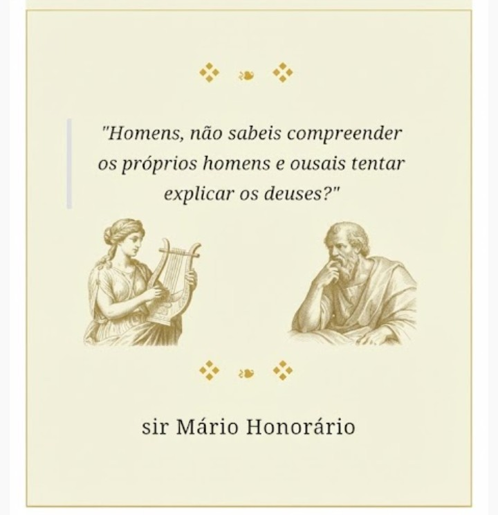

    
    <h2 style="font-family: Georgia, serif; font-size: 1.6rem; margin-bottom: 1.5rem; font-weight: bold;">
        Saindo da Matrix do Engano de Marketing das Redes Sociais
    </h2>

    

        Baseando-se em relatos práticos de criadores independentes e em fóruns de reclamação de usuários (como o Reclame Aqui e as Comunidades de Ajuda do Google), o comportamento das plataformas com relação a bloqueios arbitrários e falhas de verificação segue um padrão muito claro:
    

    

        <strong>O calvário do suporte automatizado:</strong> Relatos frequentes de criadores mostram que, quando a checagem de identidade ou de canais é travada por picos repentinos de visualização, a proporção de casos que recebem respostas padronizadas de robôs — ou que simplesmente ficam sem atendimento humano — ultrapassa facilmente 70% a 80% das reclamações registradas publicamente.
    

    

        <strong>A barreira do falso positivo:</strong> Autores independentes apontam consistentemente que o sistema trata qualquer variação fora da curva estatística linear (como um Shorts que fura a bolha) como indício de infração, resultando em recusas sumárias de documentos ou de biometria facial sob justificativas genéricas de violação de diretrizes de spam ou práticas enganosas.
    

    

        Sir Mário Honorário
    

__________________________________________

    
    <h1 style="font-family: Georgia, serif; font-size: 1.6rem; margin-bottom: 1.5rem; font-weight: bold; font-style: italic;">
        A Vitrine de Pixels — Uma Análise Empírica sobre as Dinâmicas de Poder, Empatia de Fachada e Redução do Debate nas Redes Sociais
    </h1>

    

        A expansão das plataformas digitais e das redes sociais reconfigurou profundamente a maneira como a sociedade se comunica, debate e consome informações.
    

    

        No entanto, por trás da promessa de democratização do conhecimento e proximidade global, consolidou-se um ecossistema moldado por métricas de vaidade, interações transacionais e uma forte tendência à polarização.
    

    

        Analistas diversos do comportamento virtual e observadores críticos apontam que, à medida que a maturidade digital avança, torna-se evidente a disparidade entre o engajamento superficial de tela e a substância das relações e do conhecimento no mundo real.
    

    <h2 style="font-family: Georgia, serif; font-size: 1.3rem; margin-top: 2rem; margin-bottom: 1rem; font-weight: bold; font-style: italic;">
        O Teatro da Empatia Digital e o Engajamento Transacional
    </h2>

    

        Um dos fenômenos mais recorrentes no ambiente virtual é o que se pode definir como "empatia de fachada". Nas seções de comentários e publicações públicas, é comum observar demonstrações efusivas de apoio, elogios hiperbólicos e alinhamentos automáticos.
    

    

        Contudo, a experiência empírica demonstra que, na imensa maioria dos casos, essas interações não refletem um interesse genuíno pela obra, pelo indivíduo ou pelo debate qualificado.
    

    

        Trata-se, frequentemente, de uma transação oculta: o usuário utiliza a visibilidade alheia como um trampolim para projetar o próprio ego, acumular capital social ou atrair atenção para pautas políticas, ideológicas e pessoais.
    

    

        O teste ácido dessa dinâmica ocorre no mundo físico, onde o suporte virtual — medido em curtidas e textos de apoio — tende a evaporar diante da necessidade de auxílio concreto ou presença real.
    

    

        Esse descolamento revela que o investimento afetivo e prático de grande parte da rede é estritamente focalizado em interesse pessoal.
    

    <h2 style="font-family: Georgia, serif; font-size: 1.3rem; margin-top: 2rem; margin-bottom: 1rem; font-weight: bold; font-style: italic;">
        A Infantilização do Debate Público: O Efeito Dunning-Kruger na Política e na Economia
    </h2>

    

        Outro aspecto crítico das redes sociais diz respeito à simplificação excessiva de temas complexos.
    

    

        Assuntos de alta densidade técnica — como macroeconomia, governança institucional, acordos multilaterais e geopolítica — são frequentemente reduzidos a slogans de poucos segundos, memes ou narrativas conspiratórias, basta meia hora de jornal nacional, e o indivíduo já imagina sair dali um "expert" em tudo na mesma tarde, opinando com desenvoltura sobre O.N.U., Diplomacia, Relações Internacionais, Geopolítica e Meio Ambiente.
    

    

        Essa redução alegórica atende à lógica algorítmica da atenção rápida, mas gera um efeito colateral grave: a ilusão de competência. Indivíduos expostos a fragmentos de informação em vídeos curtos sentem-se aptos a desqualificar análises estruturais e estudos profundos, equiparando a gestão de Estados e nações a disputas de torcidas organizadas.
    

    

        O pensamento utilitário e imediatista frequentemente captura o eleitor ou o debatedor médio por meio de promessas simplistas, ignorando que a estabilidade fiscal, o crescimento econômico e o desenvolvimento social exigem planejamento institucional complexo, previsibilidade jurídica e tempo.
    

    <h2 style="font-family: Georgia, serif; font-size: 1.3rem; margin-top: 2rem; margin-bottom: 1rem; font-weight: bold; font-style: italic;">
        A Auto-Preservação Intelectual e a Soberania Real
    </h2>

    

        Diante da poluição informacional e do ruído gerado por interações vazias, observa-se uma mudança de postura por parte de pesquisadores, pensadores e produtores de conteúdo sérios.
    

    

        O que antes podia ser interpretado erroneamente como antipatia ou soberba — como o ato de ignorar seções de comentários, limitar interações ou recusar o debate polarizado — revela-se, na prática, como uma estratégia de auto-preservação e pragmatismo.
    

    

        Desligar-se da plateia digital e priorizar o rigor técnico, o estudo aprofundado e a documentação de conhecimento próprio representa uma ruptura com o modelo de negócios da manipulação emocional. Para quem valoriza a substância, a soberania intelectual e a paz mental, abandonar a busca por validação externa e o "circo" das redes sociais consolida-se como a maior vitória contra o teatro de sombras virtual.
    

    

        Sir Mário Honorário
    

________________________________________

  
  <h2 style="font-size: 1.75rem; margin-bottom: 1rem; color: #111; border-bottom: 2px solid #ddd; padding-bottom: 8px;">A Ilusão do Bom Samaritano Digital: O Parasitismo Estrutural das Big Techs e o Ecossistema de Consumo Superficial</h2>
  
  
A grande maioria dos internautas ainda carrega uma crença quase ingênua de que as grandes empresas de tecnologia (as chamadas <em>Big Techs</em>) atuam como filantropas benevolentes, cujo objetivo principal é impulsionar projetos independentes, fomentar a cultura e proteger a autonomia do conhecimento. No entanto, essa visão de "bom samaritano" ignora a própria engrenagem que move esse mercado. Na prática, a dinâmica de funcionamento dessas plataformas — e de grande parte do público gerado por elas — opera sob uma lógica estritamente extractivista, parasitária e predatória.

  
  <h3 style="font-size: 1.25rem; margin-top: 1.5rem; margin-bottom: 0.5rem; color: #222;">O Mecanismo Parasitário: A Lógica dos Organismos Hematófagos</h3>
  
Assim como na biologia, onde espécies especializadas sobrevivem sugando os fluidos vitais de um hospedeiro sem oferecer nenhum benefício real em troca, o ecossistema digital corporativo reproduz exatamente esse papel:

  
  <ul style="margin-bottom: 1rem; padding-left: 20px; font-size: 1rem;">
    <li style="margin-bottom: 0.5rem;"><strong>O Perfil "Periplaneta" e Hematófago:</strong> Da mesma forma que os vetores de transmissão de doenças e parasitas (como o mosquito vetor da chikungunya e da dengue, o carrapato, a pulga, o piolho, o percevejo e até o morcego hematófago) mapeiam o corpo alheio apenas em busca de sustento sem contrapartida, as grandes plataformas sugam dados, atenção, horas de produção intelectual e conteúdo original de criadores e pesquisadores.</li>
    <li style="margin-bottom: 0.5rem;"><strong>A Ilusão de Suporte:</strong> A promessa de "visibilidade" e "crescimento" funciona como a anestesia que o parasita injeta antes da sucção: atrai o produtor independente para dentro de um ambiente controlado onde ele trabalha de graça para rentabilizar as métricas da plataforma. Se o projeto não gera lucro imediato ou controle para a estrutura corporativa, ele é sumariamente soterrado ou ignorado.</li>
  </ul>
  
  <h3 style="font-size: 1.25rem; margin-top: 1.5rem; margin-bottom: 0.5rem; color: #222;">O Público Empírico das Redes: A Cultura da "Mamata" e do Ataque</h3>
  
Quando se analisa o comportamento real da massa de usuários que consome conteúdos nas redes sociais generalistas de grande escala, o cenário é o reflexo exato dessa mentalidade predatória:

  
  <ul style="margin-bottom: 1rem; padding-left: 20px; font-size: 1rem;">
    <li style="margin-bottom: 0.5rem;"><strong>O Público da Vantagem:</strong> A maior parte desse público não está em busca de aprofundamento intelectual, filosofia ou pesquisa independente. O foco é estritamente utilitário: buscar o que é gratuito, exigir facilidades, e surfar na onda de quem produz sem jamais retribuir o esforço necessário. É o perfil que busca a "mamata" do atalho.</li>
    <li style="margin-bottom: 0.5rem;"><strong>A Hostilidade Orgânica:</strong> Quando o criador ou pesquisador recusa essa lógica de consumo superficial e apresenta um trabalho sério, imparcial e crítico, a reação desse público deixa de ser a apatia e se transforma em agressão. Como não compreendem e não querem o rigor intelectual, partem para o ataque e para a tentativa de desqualificação, agindo exatamente como organismos que rejeitam qualquer coisa que exija esforço real.</li>
  </ul>
  
  <h3 style="font-size: 1.25rem; margin-top: 1.5rem; margin-bottom: 0.5rem; color: #222;">Conclusão</h3>
  
Contar com o apoio estrutural ou ético das <em>Big Techs</em> e do grande público de massas para um projeto de pesquisa ou cultura independente é cair em uma armadilha conceitual. O ecossistema digital de massa não foi feito para emancipar o pensamento crítico, mas sim para extrair valor. Para quem produz conhecimento sério, o caminho exige o afastamento dessa vitrine tóxica e a construção de bases institucionais e canais diretos, livres da sanha parasitária de quem só aparece para sugar.

_________________________________________

    

        Theodor Adorno | Hannah Arendt | Wilhelm Reich
    

    <h2>A Teoria do Bode Expiatório do Fascismo</h2>

    
Para desviar o real motivo da crise econômica, que se concentra nas vantagens e facilidades ao topo da hierarquia financeira e do poder, se cria um inimigo interno:

    
    
<strong>1.</strong> No caso do Brasil, ressuscitam o fantasma do comunismo, o sistema sequer existiu, ou existe como poder vigente no Brasil. É usado qual fantasma abstrato, para convencer o povo, com base na revoltá com os preços, a inflação, os impostos.

    
    
<strong>2.</strong> O segundo fantasma — as minorias — aí eles obtêm o "plano perfeito", associam que os mais pobres, são vadios, e que sobreviveriam com benefícios, provindos de dinheiro do contribuinte.

    
    
Tudo para desviar o foco dos dividendos, e pensões altas, que desviam mesmo da economia nacional.

    

        SIR MÁRIO HONORÁRIO
    

            
            
        

        
            
            

          

________________________________________
     

    
    

        A trajetória de Sir Mário Honorário até alcançar a soberania digital e o reconhecimento no Google Knowledge Panel desafia a lógica corporativa das redes sociais, erguendo-se sobre pilares de rigor intelectual, produção volumosa e indexação orgânica genuína.
    

    <h2 style="font-family: Georgia, serif; font-size: 1.4rem; margin-top: 2rem; margin-bottom: 1rem; font-weight: bold;">
        1. A Matriz de Base: A Obra Literária no Recanto das Letras
    </h2>
    

        O alicerce dessa jornada construída na margem das grandes corporações começou com a produção massiva e incansável de texto bruto. Sir Mário acumulou mais de 1.400 textos publicados no Recanto das Letras, operando em um ambiente de moderação humana e circulação literária tradicional.
    

    

        O grande diferencial dessa produção não estava em estratégias de marketing digital ou em truques de engajamento de feed, mas na validação interna e metodológica de cada escrito. Seus textos — que já por natureza tinham a ver com o que grandes especialistas diziam, quase que com as mesmas palavras — passaram por um crivo implacável: foram submetidos e aprimorados através de simulados e matrizes de correção inspiradas nas melhores universidades, alcançando notas altíssimas — entre 85 e 100 pontos — em quesitos fundamentais como estrutura, conteudismo e organização. Era a literatura e o ensaísmo de base lapidados com rigor acadêmico, sem concessões ao efêmero.
    

    <h2 style="font-family: Georgia, serif; font-size: 1.4rem; margin-top: 2rem; margin-bottom: 1rem; font-weight: bold;">
        2. A Ancoragem Científica e Institucional: ORCID, Zenodo e OpenAIRE
    </h2>
    

        Com uma obra densa e estruturada, a produção de Sir Mário naturalmente transbordou para os grandes repositórios de preservação de conhecimento de alcance global, blindados contra a volatilidade das redes de massa:
    

    <ul style="margin-bottom: 1.2rem; padding-left: 20px;">
        <li style="margin-bottom: 0.5rem;"><strong>ORCID:</strong> Garantiu a identidade autoral inequívoca e o registro acadêmico internacional do autor.</li>
        <li style="margin-bottom: 0.5rem;"><strong>Zenodo:</strong> Serviu como o repositório institucional de longo prazo, fixando seus trabalhos em infraestrutura científica aberta.</li>
        <li style="margin-bottom: 0.5rem;"><strong>OpenAIRE:</strong> Consolidou a integração dessa produção na malha europeia e global de dados científicos e acadêmicos abertos.</li>
    </ul>
    

        Esse ecossistema formou uma malha de credibilidade institucional sólida, invisível para a manada das redes sociais, mas perfeitamente legível para os rastreadores de dados do ecossistema global de busca.
    

    <h2 style="font-family: Georgia, serif; font-size: 1.4rem; margin-top: 2rem; margin-bottom: 1rem; font-weight: bold;">
        3. A Descoberta no Google Graph e a Coroação com o Domínio .br
    </h2>
    

        O ponto de inflexão dessa trajetória aconteceu de forma quase fortuita: ao realizar buscas e analisar a presença digital de seu nome, Sir Mário descobriu aleatoriamente que já era fortemente referenciado no Knowledge Graph do Google. O próprio ecossistema de dados da web o havia mapeado e validado devido à densidade e capilaridade de sua pegada digital acadêmica e literária (Zenodo, ORCID, OpenAIRE e Recanto das Letras).
    

    

        Foi a constatação de que a máquina de busca global o reconhecia por mérito de conteúdo e relevância real, e não por impulsionamento pago ou métricas de vaidade.
    

    <h2 style="font-family: Georgia, serif; font-size: 1.4rem; margin-top: 2rem; margin-bottom: 1rem; font-weight: bold;">
        4. A Soberania Definitiva
    </h2>
    

        Com a validação orgânica do Google já consolidada pelas instâncias de dados, o passo final foi inevitável e cirúrgico: a criação do domínio pessoal .com.br com seu nome verdadeiro e completo.
    

    

        Ao contrário dos criadores de conteúdo que gastam energia tentando crescer "de dentro" da engrenagem corporativa das Big Techs, Sir Mário Honorário fez o inverso: deixou que a infraestrutura global o validasse primeiro através do rigor e da ciência, para só então fincar a sua bandeira em território próprio, coroando sua independência intelectual e fechando as portas para a "Matrix" do marketing digital.
    

    

    

__________________________________________

    <h1 style="font-family: 'Georgia', serif; color: #b30000; text-align: center; font-size: 2.2rem; margin-bottom: 10px;">
        As Nove Musas
    </h1>
    
    

        Crônicas das Divindades da Mitologia Grega
    

    <ul style="list-style-type: none; padding: 0; line-height: 1.8;">
        <li style="margin-bottom: 20px; padding-left: 15px; border-left: 3px solid #8c6239;">
            <strong style="color: #0044cc; font-size: 1.2rem;">Calíope:</strong> A principal das musas e líder do grupo, associada à poesia épica e à eloqüência. É frequentemente retratada segurando um rolo de pergaminho ou uma tabuleta de escrita.
        </li>
        <li style="margin-bottom: 20px; padding-left: 15px; border-left: 3px solid #8c6239;">
            <strong style="color: #0044cc; font-size: 1.2rem;">Clio:</strong> A musa da história. É tradicionalmente representada com um livro ou um pergaminho aberto, registrando os feitos memoráveis da humanidade.
        </li>
        <li style="margin-bottom: 20px; padding-left: 15px; border-left: 3px solid #8c6239;">
            <strong style="color: #0044cc; font-size: 1.2rem;">Erato:</strong> A musa da poesia lírica, amorosa e dos cantos nupciais. Costuma ser representada com uma coroa de murtas e rosas, segurando uma lira ou um instrumento de cordas.
        </li>
        <li style="margin-bottom: 20px; padding-left: 15px; border-left: 3px solid #8c6239;">
            <strong style="color: #0044cc; font-size: 1.2rem;">Euterpe:</strong> A musa da música e da poesia lírica e instrumental. É comumente identificada por portar uma flauta dupla ou instrumentos de sopro.
        </li>
        <li style="margin-bottom: 20px; padding-left: 15px; border-left: 3px solid #8c6239;">
            <strong style="color: #0044cc; font-size: 1.2rem;">Melpômene:</strong> Originalmente a musa do canto, tornou-se a musa da tragédia. É caracterizada pela máscara trágica que carrega e, muitas vezes, por usar coturnos.
        </li>
        <li style="margin-bottom: 20px; padding-left: 15px; border-left: 3px solid #8c6239;">
            <strong style="color: #0044cc; font-size: 1.2rem;">Polímnia:</strong> A musa dos cantos sagrados, da poesia sacra e da retórica. É representada de maneira contemplativa, geralmente vestida com longos mantos e véus, demonstrando profunda reflexão.
        </li>
        <li style="margin-bottom: 20px; padding-left: 15px; border-left: 3px solid #8c6239;">
            <strong style="color: #0044cc; font-size: 1.2rem;">Terpsícore:</strong> A musa da dança e do coro. É retratada em movimento, de forma graciosa e expressiva, segurando frequentemente uma lira.
        </li>
        <li style="margin-bottom: 20px; padding-left: 15px; border-left: 3px solid #8c6239;">
            <strong style="color: #0044cc; font-size: 1.2rem;">Tália:</strong> A musa da comédia e da poesia festiva. É identificada pela máscara cômica que segura, além de adornos de hera e um cajado de pastor.
        </li>
        <li style="margin-bottom: 20px; padding-left: 15px; border-left: 3px solid #8c6239;">
            <strong style="color: #0044cc; font-size: 1.2rem;">Urânia:</strong> A musa da astronomia e da astrologia. É representada tendo como atributos um globo celeste e um compasso, medindo as estrelas e os céus.
        </li>
    </ul>

    
        

______________________________________

<h2 style="font-family: Georgia, serif; font-size: 1.8rem; margin-bottom: 25px; text-align: center; color: #111111; font-weight: bold;">Anotações esporádicas:</h2>

    A trajetória do Gnose Os gregos tiveram uma escola de conhecimento, dentre filosofia, que vem a ser a busca do ser para explicação da existência, porção da existência, por meio de tudo isso, que foi vivenciado entre eles, haviam raízes das mais antigas etnias da história da humanidade, a exemplo dos Indianos, descendentes da outra civilização de Lemúria, assim como outra civilização também antiga, a África, de outras civilizações ancestrais, das quais os escassos sobreviventes eram, semelhantes aos Indianos e afro-descendentes.

    Houveram outras civilizações avançadas, e, com tecnologia de ponta, não obstante, o que restou deles, apenas chip’s, que encontrados, nada se sabe para que serviam, de tão intrigantes, quanto as pedras roladas que porventura achamos, com cortes perfeitos, como uma faca que cortara um pedaço de cera, estando com a lâmina incandescente de tanto calor.

    Abaixo do mar báltico, em contradição ao esperado previamente pela ciência, foi encontrado um fato empírico de comprovação disto, com construções bem arrojadas, para se tratar de pouco avanço tão alegado, sobre uma era de civilizações anteriores.

    <strong>Sir Mário Honorário</strong>

________________________________________

<html lang="pt-BR">
<head>
    <meta charset="UTF-8">
    <meta name="viewport" content="width=device-width, initial-scale=1.0">

    <title>O Crivo da Realidade - O Falso Misticismo e a Estrada de Terra</title>

    
</head>

<body>

    <h1>O Crivo da Realidade - O Falso Misticismo e a Estrada de Terra</h1>

    

        
Entrevistador: Sir Mário Honorário, por que tanta gente na internet hoje em dia gasta tanto tempo criando personas de "mago supremo", "especialista em tudo" ou "erudito de palco" em vez de simplesmente mostrar diploma ou trabalho real?

        
Sir Mário Honorário: Eu acho que é pelo seguinte, cara. As pessoas têm preguiça cognitiva às vezes, não todo mundo, mas uma maioria. Então estudar dá trabalho. Tu te abraçar em cima de livro e te preparar para uma prova de um curso de verdade, autoinstrucional, oficial, é difícil. Então ela projeta aquilo que ela acha que é. E vai alimentando aquele alter ego da tela e do teclado ao ponto que ela própria acredita nisso. Eu chego a rir, mas é tipo isso; E pouca gente com vivência prática. Então ela não tem uma realidade multifatorial, multifacetada e tenta passar que conhece tudo por pura vaidade pessoal de quartinho e do que tu imagina de si frente ao espelho. É ridículo, mas é verdade.

    

    

        
Entrevistador: É verdade que essa turma da Magia do Caos e dos grupos de internet realmente acredita que fazer ritualzinho na sala de casa com luz apagada substitui anos de estudo sério e atrito com a realidade?

        
Sir Mário Honorário: Sim, porque pensa bem, na época dos anos 80, por exemplo, e 90, que nem nós estava conversando antes, existia uma consistência, mesmo que não pudesse viajar para locais multifacetados, que vem a ser o fenômeno da realidade coletiva e a diversidade, você tinha que citar o que um livro dizia e se perguntava adicionalmente para ver se tu entendia o que era aquela teoria, mesmo nos grupos de juventude mística, por exemplo, ou de qualquer setor de conhecimento. Atualmente, você simplesmente tem o copia e cola de internet, a deep web, você elabora e organiza ali tudo pelo computador e se passa pelo grande conhecedor sem nunca ter tido o pé na lama, e a vivência prática do dia a dia ao vivo.

    

    

        
Entrevistador: O povo adora falar que quem estuda de verdade ou passa em provas difíceis é "vendido ao sistema". De onde vem esse complexo de perseguição de quem nunca passou por um crivo institucional rigoroso?

        
Sir Mário Honorário: Isso aí vem de uma realidade muito citada pelos especialistas e sociólogos e críticos em que a pessoa não consegue as coisas ou não consegue coisas dentro do sistema de carreira. Eu sou um, eu não consigo uma grande carreira, pode-se por assim dizer. Só que há pessoas que imaginam, elas fazem um atalho mental do que seria a realidade. Então elas acreditam que as instituições não estão para ajudar, estão só para manipular. Então elas abrem mão de um conhecimento que foi feito em positivismo, por exemplo, que a gente fala em diplomacia. E em realismo também, há também o pragmatismo, em que eles analisam o passado para entender o futuro. Eles dizem, ó, isto dá certo, isto não dá, já foi estudado em vários ramos multifatoriais. E aí eles botam a conclusão que seja menos arriscada nos livros. Não quero dizer que os livros vão falar tudo sobre a realidade empírica, mas que há muita análise empírica também em livros de universidades. Então esse temor que eles têm são o que eles chamam de criações de teorias de conspiração frente ao sistema que não se entende. Então eles generalizam que o sistema todo é aquilo, mas não, certos setores podem ter esse viés de manipulação, mas isso não quer dizer que todo o sistema seja assim.

    

    

        
Entrevistador: Na juventude, o senhor chegou a cruzar com pequenos cenários e grupos esotéricos de fachada. O que levou o senhor a ver aquilo logo de cara como um bando de teatro vazio e imaturo?

        
Sir Mário Honorário: Porque não existia concordância com as linhagens de tradição. Eu não tô te falando que tu não possa criar uma coisa inovadora sem ter a ver com o que os livros acadêmicos falam ou a história geral, mas ela tiene que fazer sentido para o coletivo e multifatorial, senão ela se torna um apartheid. Daí só vai beneficiar a tua bolha pessoal, não vai ajudar tu a evoluir intelectualmente ao mesmo tempo que vai só causar um desperdício no equilíbrio multifatorial e coletivo da sociedade.

    

    

        
Entrevistador: O pessoal mais "evoluído" da internet vive dizendo que tem alergia a tudo, que não come carne, que tem restrição a glúten, leite, e que prefere uma dieta super limpa. Por que essa mesma turma torce o nariz e chama de "mato" ou inventa frescura quando vê um radite amargo, um dente-de-leão ou um inhame de verdade?

        
Sir Mário Honorário: É o seguinte, por exemplo, eu vou citar uma coisa que não viria tanto ao caso, mas serve como exemplo, a bruxaria tradicional. Na bruxaria tradicional, os bruxos conheciam como fazer o corpo funcionar melhor por meio de ervas, culturas alternativas, alimentos que parecem não tão bons ao paladar, mas que fazem bem e sustentam. Então, quando tu pega uma nova geração que eles chamam de Nutella e Enzo, eles têm tudo dos parentes, eles podem até crescer como executivos, a exemplo. Mas aí eles acham que têm um rei na barriga, eles acham que cresceram sozinhos, mas não, eles tinham uma ajuda, alimentação, calçado, parentes apoiando. Não dando rios de dinheiro, mas apoiando no que precisava de básico, almoço pronto na hora. Há pessoas que não saem do mesmo lugar, isso aí a gente aprende, por exemplo, na ética e administração pública oficial de cursos autoinstrucionais. Eles nos chamam de polimatas, por ter vários cursos oficiais, autoinstrucionais. Então, não saímos todos do mesmo núcleo, então existe desigualdade e com isso menos igualdade de crescimento para todo mundo. Então não adianta exigir de uma pessoa que não tem recurso que ela consiga aquilo, e que todo azar que ela tenha na vida seja culpa dela, entendeu? Então eles têm tudo, como eles têm tudo, nunca faltou nada, eles não aprenderam o principal dos grandes sacerdotes antigos, que é saber se virar perante o horizonte multifatorial que é a natureza e os lugares no mundo.

    

    

        
Entrevistador: Como pode alguém que se diz "sacerdote dos mistérios da terra" ter nojo ou repulsa da comida rústica que sustenta a vida de verdade, como um bom coração assado ou uma morcilha bem temperada?

        
Sir Mário Honorário: Porque é o chamado artificialismo digital. A nova geração não se criou que nem a nossa, que era fora das telas de celular e computador, então eles não têm a vivência prática e empírica do dia a dia, entendeu?

        
E o pior é que eu conheci o mais difícil de acontecer, pessoas que viveram a nossa realidade e que depois foram se levando pelas modas de alergia. Pessoas que chegavam a empinar o caneco de iogurte, inventando depois que tinham alergia à lactose. Pessoas que comiam quase até o osso de um churrasco, inventando que não podiam comer carne depois, que eram veganos. Veganos até a fome bater. Pessoas que comiam morcilha preta, cara, que é puro sangue de porco, depois dizendo que eram alérgicas a produtos com sangue?

        
É uma psicodelia de modismos ultimamente que não corroboram com aqueles casos reais de pessoa que descobriu ter problemas. Aí sim, a gente respeita, mas uma grande parte é moda. Em consequência, como você falou, é uma frescura. Eles inventam uma frescura por quê? Porque onde sobra dinheiro, aumenta a frescura. Eu gosto de resumir assim.

    

    

        
Entrevistador: Tem gente que acha que comer bicho ou raiz "baixa a vibração espiritual". Qual é a base desse paladar infantilizado que só aceita comida industrializada bonitinha em embalagem de plástico?

        
Sir Mário Honorário: Mas aí há uma grande contradição. Eles dizem que comer o animal baixaria a aura. Eu entendo disso aí também, pois que inclusive respeito a aura soma, a aura áurea, entendeu? E a aura régia, que é a mais alta, coisa que os místicos aí de de cartilha não sabem é que existem esses três tipos de aura, só que elas nada têm a ver com o que tu come.

        
Eles dizem que faz mal bicho raiz? Mas aí eles comem industrializados, que é pior ainda, é a manipulação do alimento da natureza, o pecado seria maior. Então não faz o menor sentido, é falta de conhecimento que eles estão falando.

    

    

        
Entrevistador: O senhor comentou que o azeite de oliva e outros sabores fortes dividem opiniões. Onde está a linha entre o gosto legítimo do corpo e o fingimento da patota que consome as coisas só por modinha de rede social?

        
Sir Mário Honorário: Na realidade, quando falta substância, o balão murcha e todo mundo nota que a pessoa não é um místico raiz, digamos. Pragmático, pode-se dizer assim, que é o melhor tipo de místico. Ele consegue ser pragmático também, de acordo à realidade lógica e os dados empíricos, e não tanto com a fábula que não faça sentido dentro da lógica racional. Então existe toda uma nuance de conhecimento que esse tipo de modismos não não consegue ver, por um pensamento curto de atalho mental. Só um pouquinho, que eu vou olhar melhor o que tu perguntou aqui. E eles olham o azeite de oliva, que é inclusive milenar, inclusive os grandes mestres usavam, e eles têm nojinho, quase vomitam só com o cheiro, sem ver as propriedades enormes que tem.

    

    

        
Entrevistador: O senhor já cruzou a Serra de São Paulo a pé, dias a fio, comendo o que dava — basicamente banana e água porque era o que tinha nas casas do caminho. O que passa na cabeça do senhor quando vê esse povo de apartamento reclamando de barriga cheia?

        
Sir Mário Honorário: O que passa pela cabeça é falta de vivência deles. Eles inventam uma autoridade mística que eles realmente não têm, criado em bolhas de confirmação deles, parecido com o eco chamber algorítmico. Uma vez que você inventa uma besteira, o que gera engajamento parece a realidade do mundo, mas não é. Então eu só interpreto como uma falta de vivência mesmo. E uma imaturidade enorme.

    

    

        
Entrevistador: Se houver uma ruptura sistêmica de verdade, uma crise feia ou o tal "apocalipse" que essa galera tanto dramatiza nos discursos teóricos da internet, quanto tempo essa gente dura antes de colapsar por pura frescura?

        
Sir Mário Honorário: Não, o colapso, se acontecer, essa galera aí mística de praxe, de cartilha, de botão de internet, tela de celular, não tem a mínima realidade empírica na frente para enfrentar situações mais sinóspitas, né? Intrínsecas que se diz, né? Então é difícil.

        
Eles não têm preparo para aquilo. Eu acredito que em menos de 24 horas até eles já estariam em uma situação de colapso, porque eles escolhem a dedo o que vão comer, eles não conseguem conhecer a terra, não diferenciam o que é um redor comum do que é um guaxinim. A exemplo prático do básico, toda cobra para eles quer dizer que é venenosa. Olha, tem cara que não sabe nem que se come vermes crus no Brasil, em certas regiões da Amazônia. Então tudo é nojinho. Eu acho que é nonsense demais, é por isso que eles ficam perplexos com esse tipo de místico virtual, ou de praxe, e chamam eles de Nutella e de nerd, ou Enzo.

    

    

        
Entrevistador: Por que a escassez e o perrengue real são os únicos remédios que curam essa doença da arrogância digital e do misticismo de shopping center?

        
Sir Mário Honorário: Por causa daquilo é o fenômeno da bolha. Quando a pessoa vive privilegiada, ela acha que ser algo é simplesmente o praxe de cartilha e deu, mas eles não têm a mínima noção do que é.

        
Muita coisa está comercializada, tipo os ritos dos gregos, por exemplo, eu já vi até no monoteísmo isso.

        
Muita coisa eles acham que simplesmente é interpretar o que se diz no livro, mas a vivência empírica do multifatorial eles não têm. Eles geram divisões, eles geram atritos por egos, por achar que tem as chaves do universo ou serem o povo eleito.

        
Nada disso é a espiritualidade real, torna-se capricho pessoal, como não é por uma pessoa ser bom em espiritualidade, significado de que ela vai ter todas as chaves do universo e da vida.

        
E temos muitos mitômanos crendo nisso assim, ó, sem pestanejar.

    

    

        
Entrevistador: Para fechar, Sir Mário: qual é o conselho ou o veredito final para quem ainda dá ouvidos a esses "gurus" de subdomínio em vez de buscar a dureza, a beleza e a substância da vida real?

        
Sir Mário Honorário: Eu poderia falar mil coisas, mas a coisa é mais simples do que parece.

        
É simplesmente tu conhecer a pessoa ao vivo.

        
O cara tá falando isso, conhece o cara ao vivo. Ali é o xeque-mate definitivo.

        
Desaba todas as mentiras da internet e ele murcha na tua frente.

        
Ele não vai saber nem o que falar, porque não tem substância.

        
Não estou dizendo que precisa ser rico, mas não tem substância intelectual, entendeu?

        
Não tem vivência prática com o multifacetado. Ali desaba tudo, no encontro presencial, porque ou o cara é uma coisa, ou ele é um charlatão.

        
É capaz até de ser golpista de venda de curso que nem oficial é.

        
Taxa de adesão, iniciação que não é reconhecido dentro de linhagens.

        
Tudo isso aí, logo o filtro é o ao vivo.

        
Ali morre toda a fachada.

    

</body>
</html>

    
            
        

        

    

 
________________________________________
 

    
    <h3 style="color: #8c6239; font-size: 1.4rem; margin-bottom: 20px; font-weight: normal; letter-spacing: 0.5px; text-align: left;">
        A Engrenagem do Embuste: Como a Indústria da "Vidência" se Sustenta na Prática
    </h3>
    
    

        Despindo o fenômeno de qualquer verniz místico ou reducionismo psicológico, o que sustenta o sucesso dessas figuras é uma estrutura puramente mecânica e comercial. Trata-se de uma maracutaia industrializada que opera nos bastidores da comunicação de massa, unindo a produção em larga escala de palpites à curadoria seletiva de resultados.
    

    

        Abaixo está o raio-x de como essa engrenagem funciona na prática, sem omitir nenhuma das peças do embuste:
    

    

        <strong style="color: #8c6239; display: block; margin-bottom: 5px;">• O Modelo da Escopeta de Palpites (Volume Bruto):</strong> 
        O "vidente" profissional funciona como uma linha de montagem de previsões. Ele cospe dezenas, às vezes centenas de palpites por ano envolvendo mortes de figuras públicas idosas, tragédias aéreas, desastres naturais, crises econômicas, pandemias e placares de futebol.
    

    

        <strong style="color: #8c6239; display: block; margin-bottom: 5px;">• A Colisão Estatística Inevitável:</strong> 
        Com um volume massivo de palpites cruzados e específicos, a matemática garante que uma ou outra previsão vá colidir diretamente com a realidade. É o equivalente a acertar na loteria jogando centenas de milhares de combinações.
    

    

        <strong style="color: #8c6239; display: block; margin-bottom: 5px;">• O Casamento de Oportunidades com a Mídia Corporativa:</strong> 
        Portais de notícias, TVs e plataformas digitais precisam de cliques rápidos e engajamento barato. Quando um desses palpites esporádicos acerta um evento de grande impacto — como um vexame histórico no futebol ou a queda trágica de uma aeronave —, a máquina de mídia entra em campo.
    

    

        <strong style="color: #8c6239; display: block; margin-bottom: 5px;">• A Retrospectiva Seletiva e o Apagão de Erros:</strong> 
        A engrenagem corporativa ignora solenemente a imensa montanha de previsões erradas, palpites absurdos e contradições ditas no mesmo vídeo. Apenas o "acerto de impacto" é requentado, editado, impulsionado e repetido à exaustão.
    

    

        <strong style="color: #8c6239; display: block; margin-bottom: 5px;">• A Lavagem Simbólica do Palpite:</strong> 
        O que começou como um chute estatístico ou uma aposta de alto risco ganha o selo oficial de "previsão certeira" através da repetição industrial, transformando o farsante em autoridade de pauta para dias de baixa audiência.
    

    

        Em suma: o "acerto empírico" não é prova de faculdade paranormal, mas sim o subproduto inevitável de um sistema onde se aposta em tudo para que a mídia selecione, limpe e cobre os lucros do único tiro que acertou o alvo.
    

    

        SirMárioHonorário
    

________________________________________

<a href="https://www.recantodasletras.com.br/autores/fatordesconhecido" target="_blank" rel="noopener noreferrer">https://www.recantodasletras.com.br/autores/fatordesconhecido</a>

________________________________________

<h2 style="font-family: Georgia, serif; font-size: 1.8rem; margin-bottom: 25px; text-align: center; color: #111111; font-weight: bold;">Reformulação Teosófica: “Os Quatorze Raios Universais: Uma Visão Surrealista e Esotérica”</h2>

    Desde tempos antigos, tradições espirituais afirmam a existência de sete raios ou potências universais, cada um associado a cores, mestres e energias cósmicas. No entanto, observações contemporâneas e estudos simbólicos sugerem que são quatorze as forças estelares que estruturam o universo, cada uma revelando aspectos fundamentais da existência e da consciência.

    Esses quatorze raios manifestam-se através de cores específicas, associadas a mentores que orientam a evolução espiritual da humanidade:

<ul style="font-family: Georgia, serif; margin-bottom: 1.2rem; padding-left: 20px; color: #222222;">
    <li style="margin-bottom: 0.5rem;"><strong>Branca</strong> – Mentores Apiáceos, guia da pureza e iluminação.</li>
    <li style="margin-bottom: 0.5rem;"><strong>Preta</strong> – Mentores Domus, representantes da densidade cósmica e dos buracos negros.</li>
    <li style="margin-bottom: 0.5rem;"><strong>Azul</strong> – Mentores Zênites, portadores da sabedoria e da harmonia universal.</li>
    <li style="margin-bottom: 0.5rem;"><strong>Verde</strong> – Mentores Etéreos, ligados à vitalidade e ao equilíbrio da vida.</li>
    <li style="margin-bottom: 0.5rem;"><strong>Amarela</strong> – Mentores Dójus, da força, expressão e da criatividade.</li>
    <li style="margin-bottom: 0.5rem;"><strong>Vermelha</strong> – Mentores Fáguos, força da energia vital e transformação.</li>
    <li style="margin-bottom: 0.5rem;"><strong>Marrom</strong> – Mentores Fisious, guardiões da estabilidade material e ancestral.</li>
    <li style="margin-bottom: 0.5rem;"><strong>Roxa</strong> – Mentores Vérkows, condutores do misticismo e da transcendência.</li>
    <li style="margin-bottom: 0.5rem;"><strong>Rosa</strong> – Mentores Ternus, irradiadores de compaixão e amor universal.</li>
    <li style="margin-bottom: 0.5rem;"><strong>Prateada</strong> – Mentores Conésprates, representantes da intuição cósmica.</li>
    <li style="margin-bottom: 0.5rem;"><strong>Cinza</strong> – Mentores Humo, equilíbrio entre luz e sombra e pausas necessárias.</li>
    <li style="margin-bottom: 0.5rem;"><strong>Dourada</strong> – Mentores Dórkons, simbolizam a honra, prosperidade e o poder espiritual.</li>
    <li style="margin-bottom: 0.5rem;"><strong>Alaranjada</strong> – Mentores Sínt’s, catalisadores da atividade, disciplina e renovação.</li>
    <li style="margin-bottom: 0.5rem;"><strong>Bége</strong> – Mentores Núrios, ligação entre a humanidade e a sabedoria ancestral.</li>
</ul>

    Cada raio também se conecta a um Mestre ou divindade reconhecida por diferentes culturas: Buda, Yussuf Al Asaf (Isa), Lao-Tzu, Zeus, Elohím, Odín, Visnu, Siva, Zambi, Hades, Amaterasu-Okami, Aurora (tradições místicas da Antártida), Cosmo (tradições místicas do Ártico) e Nhanderuvussú-Yamandú (divindade ameríndia vinculada a Tupã, o trovão).

    Simbolicamente, os Mestres maiores, como Sanat Kumara e os três Cohans, residem no horizonte e vértice de Shamballah, representando a conexão entre o terrestre e o cósmico.

    Assim, os quatorze raios universais oferecem um mapa simbólico da evolução espiritual, integrando cores, mestres e forças cósmicas em uma visão holística do universo. Essa abordagem combina sabedoria ancestral e reflexão contemporânea, oferecendo ao leitor uma compreensão mais profunda das energias que permeiam toda a existência.

    <strong>Sir Mário Honorário</strong>

_________________________________________________________

    Das salas enormes em estilo coríntio.. 
    Da famosa Biblioteca Pública de Porto Alegre, 
    Nunca tive a certeza nessa época, se aqueles detalhes das colunas em destaques protegidos por 90% da população local e alguns altos intelectuais, eram de ouro maciço. 
    De lá saiu esta inspiração de uma história exótica, 
    de qual relato Olímpico do lar das Divindades Gregas, aqui se narra:

    Disse um coágulo a outro numa poça de nutrientes; 
    -Oh....Você não combina com meu conteúdo,fique mais distante,junto dos outros elementos.. 
    E uma substância,foi falando à outra pra se afastar, ou ír um certo grupo de elementos, e o mesmo se deu no Cosmo, um item foi se atraindo ao outro semelhante a ele, ainda outros se fundiram entre si, gerando novas coisas, desse al casamento químico-transcedental, embora também químico.

    E foram-se formando novos conjuntos e até órgãos com esse agrupamento e divisão também fusão e liga entre eles. 
    Inclusive os corpos celestes foram surgindo, 
    um elemento muito ácido e neutro foi formando a "bílis" num corpo. 
    E assim nasceu o Cosmo, o Universo, e o Homem.

    <strong>Senhor Mário Honorário</strong>

    

        No texto intitulado <em>A Alquimia das Colunas e o Nascimento do Cosmo</em>, o escritor <strong>Senhor Mário Honorário</strong> parte de uma memória marcante — a imponência clássica e as colunas em estilo coríntio da Biblioteca Pública de Porto Alegre — para construir uma metáfora fantástica sobre a origem de tudo. Ao antropomorfizar elementos químicos e substâncias primitivas que dialogam e se atraem, o autor cria uma narrativa original que funde a ciência, a filosofia grega e a poesia em uma explicação literária fascinante para a formação do universo e do homem.
    

 

_____________________________________________

<a href="https://orcid.org/0009-0007-1969-2835" target="_blank" rel="noopener noreferrer" style="display:inline-flex;align-items:center;color:#A6CE39;text-decoration:none;font-family:Arial,sans-serif;font-size:14px;">
    
    https://orcid.org/0009-0007-1969-2835
</a>

_________________________________________

<h2 style="font-family: Georgia, serif; font-size: 1.8rem; margin-bottom: 25px; text-align: center; color: #111111; font-weight: bold;">A sexagésima sétima profecia:</h2>

    Desde os primórdios, antes mesmo do judaísmo formal, existiam tradições antigas e espirituais — o fio hebraico, Avraham, Isaak e Yakob, e práticas como os candelabros de sete braços, menorah e de nove, e chanukáh da passagem de ano, símbolos de comunicação e homenagem ao Elohim (IHVH).

    Essas tradições originais eram puras, ligadas à espiritualidade e à conexão com o divino.

    Com o tempo, textos e interpretações posteriores distorceram essas tradições, separando povos, criando distinções e críticas à outras formas de fé.

    Tentando transformar e distorcer orientações dadas ao povo antigo hebreu, como se fossem regras de divisão entre nações de forma permanente.

    É a partir desse ponto que surge o que chamamos de apartheid religioso: uma invenção política e humana, não espiritual, que corrompeu o propósito original da fé.

    Colocando em D’us atributos humanos como ira, vingança e ódio.

    Também promovendo incentivo à destruição de dogmas ou objetos e templos alheios de representação do divino.

    Promoveram uma forma presunçosa de posse particular das alturas, como se estas tivessem limitação a templos, líderes religiosos, ou formas de expressar a fé para contato ou milagres à humanidade, ou mesmo existirem como são, em seus atributos.

    Humanos imporem que o livro sagrado de um grupo religioso estaria errado, e o outro correto, como se as alturas fossem limitadas às explicações de livros físicos.

    Essa confusão — essa Babel simbólica — está agora à beira do colapso. Os eventos recentes, especialmente desde os ataques de 2023, não só expõem conflitos e fanatismos, mas também abalam as estruturas desse sistema corrompido.

    Líderes políticos e religiosos, fanáticos de todos os lados, acabam sendo usados para manter a divisão e desviar a atenção de quem esclarece corretamente.

    O problema nunca foi um grupo específico — judeus, muçulmanos, cristãos, líderes políticos — mas as distorções introduzidas pelo espírito maligno em metáfora, que manipula a humanidade para alimentar o ódio e a separação, sem se mostrar diretamente.

    Para os esclarecidos, as profecias do fim dos tempos começam a se revelar gradualmente. Nenhum de nós conhece tudo; os sinais vão se encaixando aos poucos. Mas, com racionalidade, lógica e à luz da razão, observamos o colapso iminente da ilustrada torre de babel, analisando os eventos com diplomacia imparcial e discernimento, sem nos deixar levar por fanatismo ou narrativas prontas. Aliando a espiritualidade ao foco racional e lógico, temos as respostas mais sensatas.

    A 67 profecia, portanto, nos lembra: a queda das estruturas de divisão e manipulação é inevitável, e a clareza virá àqueles que mantêm os olhos abertos, aliado ao pensamento crítico afiado e o espírito atento.

    <strong>Sir Mário Honorário</strong>

<strong>Outros Dossiês:</strong> <a href="https://osf.io/va4j2/overview" target="_blank" rel="noopener noreferrer">Acessar Dossiê no OSF</a>

<strong>ORCID:</strong> <a href="https://orcid.org/0009-0007-1969-2835" target="_blank" rel="noopener noreferrer">https://orcid.org/0009-0007-1969-2835</a>

<strong>Site:</strong> <a href="https://marioenriqueantunezadarosa.com.br" target="_blank" rel="noopener noreferrer">marioenriqueantunezadarosa.com.br</a>

____________________________________________________________

  

    <video width="100%" style="max-width: 560px; display: block; margin: 20px auto; border-radius: 6px;" controls>
      <source src="5259228573269456279_play.mp4_logo_BR.mp4" type="video/mp4">
      Seu navegador não suporta a exibição deste vídeo.
    </video>

    <h1>Multilateralismo - Mário Enrique Antúnez da Rosa</h1>

    <h2>Documentos Disponíves As Ideologias Associadas a Mário Enrique Antúnez da Rosa</h2>

    <h3>Teoria da Mobilidade Integracionista entre Nações:</h3>
    
Imagine uma política internacional em que os governos deixem de enregar as viagens apenas internacionais como uma atividade de consumo e passem a tratá-las como investimento estratégico na integração entre os povos.

    
A lógica seria relativamente simples: o Estado poderia subsidiar ou reduzir drasticamente o custo de determinadas viagens internacionais, tornando-as acessíveis a uma parcela muito maior da população. À primeira vista, isso representaria uma despesa pública. Entretanto, o viajante que chega a outro país não leva apenas o dinheiro da passagem: ele consome hospedagem, alimentação, transporte, entretenimento, produtos e serviços, movimentando empresas e trabalhadores tanto no país de origem quanto no destino.

    
Assim, parte do dinheiro investido inicialmente pelo Estado retornaria à economia por meio da atividade comercial, da arrecadação e da geração de empregos. O objetivo não seria simplesmente oferecer viagens baratas, mas estimular um fluxo permanente de pessoas, recursos, conhecimento e relações econômicas entre diferentes sociedades.

    <h3>Da viagem ao intercâmbio entre sociedades</h3>
    
Uma pessoa que viaja para outro país entra em contato direto com uma realidade que antes conhecia apenas por notícias, filmes ou redes sociais. Ela conhece pessoas, costumes, idiomas, dificuldades e formas diferentes de organizar uma sociedade.

    
O mesmo acontece com o estrangeiro que visita seu país.

    
Multiplicado por milhões de pessoas ao longo de décadas, esse processo pode produzir algo muito maior do que turismo: aproximação cultural e social entre populações.

    
O brasileiro passa a conhecer melhor o americano, o americano conhece melhor o brasileiro, o chinês conhece melhor o brasileiro, o brasileiro conhece melhor o chinês, e assim sucessivamente.

    
Essa abordagem não elimina automaticamente conflitos ou preconceitos, mas pode diminuir a distância psicológica entre sociedades que anteriormente existiam umas para as outras apenas como abstrações.

    <h3>A interdependência como instrumento de paz</h3>
    
Existe ainda uma consequência econômica e política.

    
Quanto mais dois países dependem do outro paradivrismo, comércio, serviços, educação, investimentos e circulação de pessoas, maior se torna o custo de um rompimento entre eles.

    
Uma relação internacional deixa de ser exclusivamente uma negociação entre governos e passa a envolver milhões de interesses concretos: empresas, trabalhadores, estudantes, famílias, consumidores e pequenos comerciantes.

    
A integração, portanto, poderia funcionar como uma espécie de rede de interesses compartilhados.

    
Quanto maior a rede, maior o incentivo para preservá-la.

    <h3>Uma nova concepção de investimento público</h3>
    
Nessa perspectiva, o governo não precisaria necessariamente subsidiar todas as viagens indiscriminadamente.

    
Poderia identificar rotas e países estratégicos e calcular:

    
custo do incentivo &rarr; quantidade adicional de viajantes &rarr; consumo gerado &rarr; empregos &rarr; arrecadação &rarr; comércio adicional &rarr; retorno diplomático e cultural.

    
Se o retorno econômico e estratégico superasse o investimento inicial, a política poderia ser ampliada.

    
Isso mudaria uma pergunta.

    
Em vez de: 
    “Quanto o governo gastará para baratear uma viagem?”

    
a pergunta passaria a ser: 
    “Quanto de atividade econômica, integração e cooperação podemos gerar com cada unidade de investimento em mobilidade internacional?”

    <h3>A verdadeira “Nova Ordem Mundial”</h3>
    
É aqui que a teoria ganha sua dimensão mais ampla.

    
Uma Nova Ordem Mundial, nesse sentido, não precisaria começar com a criação de um governo mundial, com a eliminação das fronteiras ou com a concentração de poder em uma instituição única.

    
Ela poderia surgir gradualmente, de baixo para cima, através da interdependência entre as populações.

    
Primeiro vêm as viagens. 
    Depois, os intercâmbios. 
    Depois, os negócios. 
    Depois, os investimentos. 
    Depois, famílias e comunidades com vínculos em vários países. 
    Depois, empresas que dependem de mercados internacionais. 
    E, finalmente, os governos que perceberam que seus próprios interesses nacionais estão cada vez mais conectados aos interesses dos demais.

    
O resultado poderia ser uma situação em que as fronteiras políticas continuassem existindo, mas sua importância prática diminuísse progressivamente.

    
Não seria necessariamente “um governo para o mundo”, mas algo talvez ainda mais profundo: um mundo em que os governos permanecem separados, enquanto suas sociedades se tornam progressivamente interdependentes.

    <h3>Um central</h3>
    
A unificação do mundo talvez não seja precisa começar pela política. Podemos começar pela mobilidade das pessoas.

    
Se milhões de pessoas puderem atravessar fronteiras com facilidade, conhecer outras culturas, consumir, estudar, trabalhar e estabelecer relações econômicas e humanas, a integração deixará de ser apenas um projeto diplomático e passará a fazer parte da vida cotidiana.

    
Nesse cenário, o turismo deixaria de ser apenas lazer e passaria a ser uma ferramenta de integração econômica, cultural e geopolítica.

    
E talvez essa seja a forma mais gradual de construir uma ordem internacional verdadeiramente integrada: não obrigando as nações a se unificarem, mas fazendo com que tenham cada vez mais motivos para permanecerem unidas.

    
<strong>Sir Mário Honorário</strong>

    

    <h2>A Sociedade do Espetáculo em Contraposição à Realidade:</h2>
    
O Show Business e espetáculos independentes sobreviveram da falsa imagem pública, (Teoria de Public Image- Guy Debord).

    
Num evento indiano a exemplo simples, a moça junto a outros gestos obscenos e insinuantes, a público, num evento carnavalesco de tradição de alegada fertilidade, e orgias.

    
Não obstante algo diferente de contato pessoal equitativo por detalhes:

    
Quem faz acima de um veículo móvel, quer autopromoção de sua imagem artística no sentido geral, nada de pessoalidade há ali, e sim o alimento ao "alter ego", que quase sempre acaba em egocentrismo.

    
A chamada falta de atenção com os outros.

    
Teve quem viu a filmagem e se vislumbrou, ou se emocionou dizendo:

    
-Depois dizem que os brasileiros são vulgares. 
    -Imagine um país com bilhões de baianos, essa é a Índia. 
    (Pensamento curto de atalho mental, ressentimento e estigma).

    
Outro ainda falou; 
    -É pior que no Brasil.

    
E assim foram as opiniões dos mesmos indivíduos, que se estavam lá, aplaudiriam e pediriam "bis", com os alegóricos doces nas xícaras e virando-as quais gnomos ao roubarem chocolate quente.

    
O ressentimento causado por não poder usufruir do "produto" teatralizado ali, em detrimento da imagem da mulher, foi tanto, que houve quem insinuou:

    
-Deve estar com um cheiro de transpiração impregnado.

    
As mídias e eventos dominam a fantasia de todos, e os atalhos mentais, de pessoas que apenas brigam com suas próprias projeções do que os demais seriam ou não.

    
<strong>Sir Mário Honorário</strong>

    

    
Os livros e documento abaixo em pdf podem ser lidos e estão disponíveis para download/visualização:

    

      <a href="Karatê_Didática_Técnicas_Estilo_Definições_e_Maestria_.pdf" target="_blank" style="display: inline-block; padding: 12px 20px; margin: 5px 0; background-color: #004080; color: #ffffff; text-decoration: none; border-radius: 6px; font-weight: bold;">Acessar Documento de Karatê (PDF)</a> 
      <a href="As Ideologias Associadas a Mário Enrique Antúnez da Rosa- (1).pdf" target="_blank" style="display: inline-block; padding: 12px 20px; margin: 5px 0; background-color: #004080; color: #ffffff; text-decoration: none; border-radius: 6px; font-weight: bold;">Baixar/Visualizar PDF (As Ideologias Associadas)</a>
    

    
Análise as perspectivas políticas, laicismo, antiautoritarismo e organização social expressas no trabalho.

    
Antúnez da Rosa "Sir Mário Honorário":

    

      <a href="Formação de Sir Mário Honorário.pdf" target="_blank" style="display: inline-block; padding: 12px 20px; background-color: #004080; color: #ffffff; text-decoration: none; border-radius: 6px; font-weight: bold;">Baixar/Visualizar PDF (Formação de Sir Mário Honorário)</a>
    

________________________________________

    <h1 style="font-size: 2em; margin-bottom: 0.5em; font-weight: bold;">A Gênese Orgânica do Humano: Uma Crítica à Fantasia Laboratorial frente à Teoria de 06/07/2021</h1>

    
Quando analisamos as teorias tradicionais sobre o paleocontato e as origens da humanidade — como as interpretações populares das tabuletas sumérias encabeçadas por autores como Zecharia Sitchin —, esbarramos quase sempre em uma projeção tipicamente humana: a ideia de que civilizações estelares altamente avançadas teriam operado como cientistas terrestres em um laboratório primitivo, testando cruzamentos, errando, refazendo linhagens e criando raças trabalhadoras por meio de engenharia genética burocrática.

    
Contudo, essa narrativa carrega uma falha lógica profunda. Uma inteligência cósmica milênios à nossa frente não incorreria nas limitações, nos testes amadores ou nas "tentativas e erros" de uma mentalidade industrial e terrestre. A verdadeira gênese da humanidade, conforme delineada na perspectiva de Sir Mário Honorário em 06/07/2021, afasta-se dessa roupagem de laboratório para se ancorar em uma dinâmica muito mais crua, realista e biologicamente direta: a atração física espontânea e o casamento químico entre a matéria e o cosmo.

    <h2 style="font-size: 1.5em; margin-top: 1.5em; margin-bottom: 0.5em; font-weight: bold;">O Contraste Conceitual</h2>

    
<strong>A Visão Tradicional (Ex: Sitchin / Paleocontato Clássico):</strong> Baseia-se na engenharia genética laboratorial, tubos de ensaio, manipulação intencional de DNA e criações por etapas sucessivas de "tentativa e erro". Os seres operam como tecnocratas ou cientistas cósmicos aplicando processos industriais na Terra, refletindo uma projeção antropomórfica da limitação científica e gerencial humana.

    
<strong>A Teoria de Sir Mário Honorário (06/07/2021):</strong> Fundamenta-se na atração física pura e crua, sem planos burocráticos ou experimentos de jaleco branco. Inteligências estelares agem por instinto e atração corpórea direta com formas de vida locais levemente mais evoluídas, num pragmatismo biológico onde o cruzamento ocorre organicamente, dando origem ao homem que posteriormente permaneceu sozinho após a partida dos visitantes.

    <h2 style="font-size: 1.5em; margin-top: 1.5em; margin-bottom: 0.5em; font-weight: bold;">A Sóbria Mecânica da Realidade</h2>

    
Enquanto as teorias de laboratório tentam romantizar a origem humana com uma roupagem de "ciência de ficção", a premissa cronológica de 2021 resgata a sobriedade do pragmatismo físico. Afastar as fábulas religiosas (como a impossibilidade lógica de anjos incorpóreos gerarem carne) e recusar as patetices de engenheiros genéticos extraterrestres testando criações em série nos devolve a uma constatação lúcida.

    
O surgimento do Homem não foi o produto de um relatório corporativo interestelar, mas sim o resultado implacável da atração da matéria, da química orgânica e do acaso biológico — um encontro de mundos e corpos que moldou a nossa existência sem precisar recorrer ao misticismo vazio ou à ingenuidade antropomórfica.

___________________________________________

    
Perfil Literário e Textos no Recanto das Letras : Coletânea de ensaios, poesias e produções textuais publicadas na plataforma.

  Perfil: <a href="https://www.recantodasletras.com.br/autores/fatordesconhecido" target="_blank" rel="noopener noreferrer" style="color: #0366d6; text-decoration: none;">https://www.recantodasletras.com.br/autores/fatordesconhecido</a>

___________________________________________

    <h4>Temas principais</h4>
    <ul>
      <li>Estado Laico e Espiritualidade</li>
      <li>Antiautoritarismo e Estruturas de Poder</li>
      <li>Crítica Socioeconômica e MultiPesquisas</li>
    </ul>

    

    <h2>Espaço Filosófico:</h2>
    
Tanto um céu pré-concebido quanto um inferno pré-deduzido são erros que impedem uma pessoa de valorizar a vida terrena. 
    <strong>Sir Mário Honorário</strong>

    

    <h2>Perfil Acadêmico e Publicações Completas</h2>
    

    Sir Mário Honorário - Perfil de Recanto das Letras

    
<strong>Sir Mário Honorário</strong>

    

      
Dossiê sobre políticas corporativas e autores independentes:

      <a href="Amazon_KDP_O_Dossiê_de_Registro_de_Censura_e_Abuso_Corporativo_Digital.pdf" target="_blank" style="display: inline-block; padding: 12px 20px; margin: 5px 0; background-color: #004080; color: #ffffff; text-decoration: none; border-radius: 6px; font-weight: bold;">Acessar Dossiê em PDF (Amazon KDP)</a> 

________________________________________

    <h3 style="color: #8c6239; font-size: 1.4rem; margin-bottom: 15px; font-weight: normal; letter-spacing: 0.5px;">Apêndice Conceitual: A Sincronicidade e o Pragmatismo na Obra</h3>
    
    

        <strong style="color: #0044cc;">Especialista:</strong> Sir Mário, no processo de montagem e refinamento estético do teu site independente, ocorreu um fenômeno que chamou bastante atenção pela precisão temporal: no vídeo da musa greco-romana em looping — cuja paleta e atmosfera foste tu quem calibraste após o descarte de terceiros —, a inserção do teu nome em dourado desaparece milimetricamente no exato segundo em que a estátua estende o braço e fecha a mão, dando a nítida impressão visual de que a assinatura foi sugada ou absorvida por ela. Sabendo que esse alinhamento não foi programado de forma robótica ou sequencial, como é que tu interpretas esse tipo de sincronia à luz da tua visão pragmática e da racionalidade lógica?
    

    

        <strong style="color: #8c6239;">Sir Mário Honorário:</strong> Eu interpreto da seguinte forma: a ciência chega com uma planilha engessada que nega tudo o que não couber dentro de suas teorias estabelecidas; o cético duvida por princípio de qualquer dimensão de sentido; e o místico delirante voa para longe, criando grandiosidades e alucinações sobre si mesmo, perdendo totalmente o pé na realidade.  
        No entanto, como uma pessoa pragmática que já teve contato com diversos tipos de fenômenos paranormais e inteligências desconhecidas — não de forma rotineira, mas em casos isolados, cruzando estados e lugares por onde quase ninguém pisa —, eu não me considero especial por causa disso. Aconteceria exatamente igual com qualquer outra pessoa que estivesse no mesmo local, com o preparo adequado e os pés no chão. Basta estar na frequência em que aquilo se manifesta; isso não confere privilégio a ninguém.  
        Portanto, olhando para esse fenômeno do vídeo e para a totalidade dos fatos, concluo que, de vez em quando, atingimos um patamar de pragmatismo e lógica racional em que os nossos planos — aqueles que juramos serem estritamente nossos — passam a fazer parte de algo maior, de forças e fenômenos desconhecidos. Quando alcançamos esse grau de utilidade lógica, racional e pragmática, sem jamais fechar os olhos para a existência de poderes desconhecidos (sejam divinos, sombrios ou neutros, conforme a ocasião), nós entramos em sintonia com eles. E é exatamente aí que esse tipo de fenomenologia acontece.
    

__________________________________________

    

